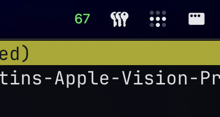

# Menubar HR Display

Simple macOS menubar-only heart rate monitor that reads Bluetooth heart-rate broadcasts.



## Installation

- clone repo at your `/Applications` folder

## Build from source

   ```sh
   swift build -c release

   ./.build/release/HR
   ```

## Usage

1. Put your heart rate monitor or smart watch into heart-rate broadcast mode.
2. Launch the app and allow Bluetooth access when macOS asks.
3. The menubar item will update with the live heart rate once the device is discovered.

The app listens for the standard Bluetooth Heart Rate Service, so any compatible HR broadcaster should work.
